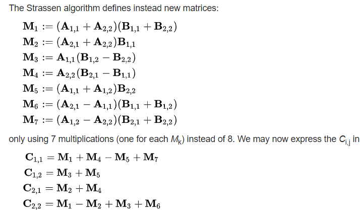

The requirements to run the Strassen program are numpy and pandas for Python.
The requirements to run the Naive program are a compiler for C++ and <iostream>, <random>, <chrono>, and <fstream> (Those should already be there, but just for thoroughness)

# Problem #1

## Setup
In the first problem, we are asked to implement the naive and Strassen method of multiplication for two matrices whose contents are random numbers generated from a uniform distribution and range from (-1,1).

## Algorithm Description: Naive Method
The naive method requires a nested nested for loop. If the two matrices are X and Y, the algorithm iterates through the rows of X, then the columns of Y, and then the rows of Y. This simulates how one row of X multiples a column of Y and so forth to do the multiplication. The algorithm then deposits the result in a csv (naive-10 for 2^10 x 2^10 multiplication and naive-12) that is in the same directory. (I did this one in C++ because the Python version takes significantly longer) 

## Algorithm Description: Strassen Method
A recursive algorithm is used for Strassen. As professor Deng said we can stop the algorithm after at least three levels so I use the built in numpy matrix multiplier once the dimensions of the inputted matrix are 2^7 x 2^7 as a base case. Otherwise, I split the matrix into four pieces and then apply the additions and subtractions to it as shown below. I then put the results in a csv (strassen-10 and strassen-12). I also put the default numpy multiplication results in csvs (default-10 and default-12) as a comparison. 

The final four quarters, the C__ , are reassembled into the matrix, which is the result.

## Pseudocode (Naive):
    def matrix_multiply(X, Y):
        result = generate_result_matrix(len(X))
        for i in range(len(X)):
            for j in range(len(Y[0])):
                for k in range(len(Y)):
                    result[i][j] += X[i][k] * Y[k][j]
        return result
    send result to csv

## Pseudocode (Strassen):
    def matrix_multiply(A, B):
        if the matrix has a shape of 2^7 x 2^7 use built-in Python methods to multiply:
            return multiplication of A and B by numpy
        else:
            Create the four pieces of the first input matrix
            Create the four pieces of the second input matrix
            Carry out the 7 multiplications and store them
            Add up the multiplications into the four quarters of the result
            Reassemble the result matrix and return it
    send result to csv

## Answer
Naive Additions: (2^10 - 1) * (2^10 * 2^10)  
Naive Multiplications: 2^10 * 2^10 * 2^10  

Strassen Additions:  
786895335   - 2294154 + numa(x)** for 2^10 x 2^10  
38557871487 - 2294154 + numa(x)** for 2^12 x 2^12   

This comes from the recurrence relation f(t) = 7 * f(t-1) + 9 where f(0) = 18.
This is because there are 7 times the Strassen mutliplication would be called recursively and then the 9 additions that are conducted when the 'M' pieces are turned into the 'C' quarters. The base case is 18 because in the 2 x 2 case there are just 18 additions (I count subtraction as an addition of a negative number). 786895335 comes from how much we would have done if the algorithm written was totally recurisive and 2294154 was what wasn't done due to going to the default multiplication after 3 to 5 levels of recursion. The numa(x)** comes from how many additions were done by numpy.  

Strassen Multiplications:  
7^10 - 7^8 + numm(x)** for 2^10 x 2^10  
7^12 - 7^8 + numm(x)** for 2^12 x 2^12   

On a 2x2 matrix there are 7 multiplications done and then each recursive call requires 7, so it is exponential in the number of multiplications required. Similar to the explanation for addition, we remove from the total the recursive calls we didn't do and add back in how many multiplications it takes for numpy to do the rest.
  

** numa(x) and numm(x) represent the number of additions and multiplications given x rows and x columns done by numpy  

